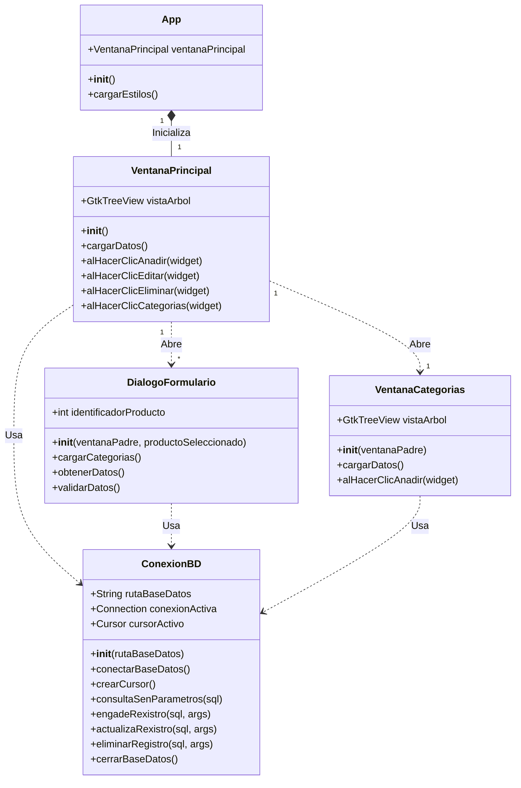
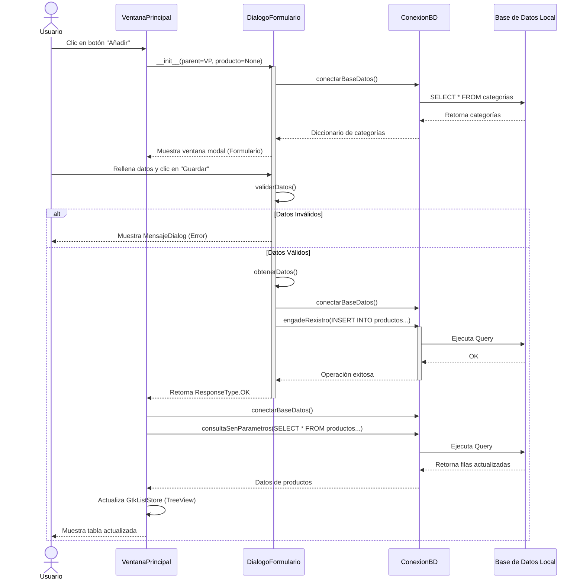

---

# 📦 Gestor de Inventario

Un sistema de gestión de inventario de escritorio, limpio y eficiente, desarrollado en **Python** utilizando **GTK3** para la interfaz gráfica y **SQLite** para el almacenamiento local de datos.

## ✨ Características

* **Gestión de Productos (CRUD):** Añade, edita, elimina y visualiza productos fácilmente.
* **Gestión de Categorías:** Organiza tu inventario creando categorías personalizadas.
* **Base de datos local:** Almacenamiento seguro en SQLite aislado en la carpeta de usuario (`~/.gestor_inventario/`).
* **Interfaz moderna:** Estilos personalizados mediante CSS (tematización completa de GtkTreeView, botones y formularios).
* **Validación de datos:** Formularios a prueba de errores.

## 📚 Documentación

Puedes consultar la documentación detallada de la API, clases y métodos, generada con **Sphinx**, en el siguiente enlace:

👉 **[gestor-inventario-samuel.readthedocs.io](https://www.google.com/search?q=https://gestor-inventario-samuel.readthedocs.io/es/latest/)**

## 🛠️ Requisitos Previos

* **Python** 3.8 o superior.
* Librerías de **GTK3** instaladas en tu sistema:
* *Linux:* Instaladas por defecto en la mayoría de distribuciones (como Debian/Ubuntu).
* *Windows:* Requiere un entorno como MSYS2 o WSL.


## 🚀 Instalación

La aplicación está publicada, por lo que puedes instalarla fácilmente a través de `pip`:

```bash
pip install .

```

## Uso

Una vez instalado, puedes ejecutar la aplicación con el comando:

```bash
xestor-inventario

```

## 🧪 Tests

Para ejecutar las pruebas unitarias de validación y conexión a base de datos:

```bash
python -m unittest discover tests/

```

## 📊 Arquitectura del Sistema

### 1. Diagrama de Clases

Este diagrama muestra cómo se relacionan las piezas principales del código, incluyendo la lógica de la aplicación, la interfaz y la persistencia.



### 2. Diagrama de Secuencia

Proceso de añadir un nuevo producto al inventario:



---

**Desarrollado por:** Samuel
